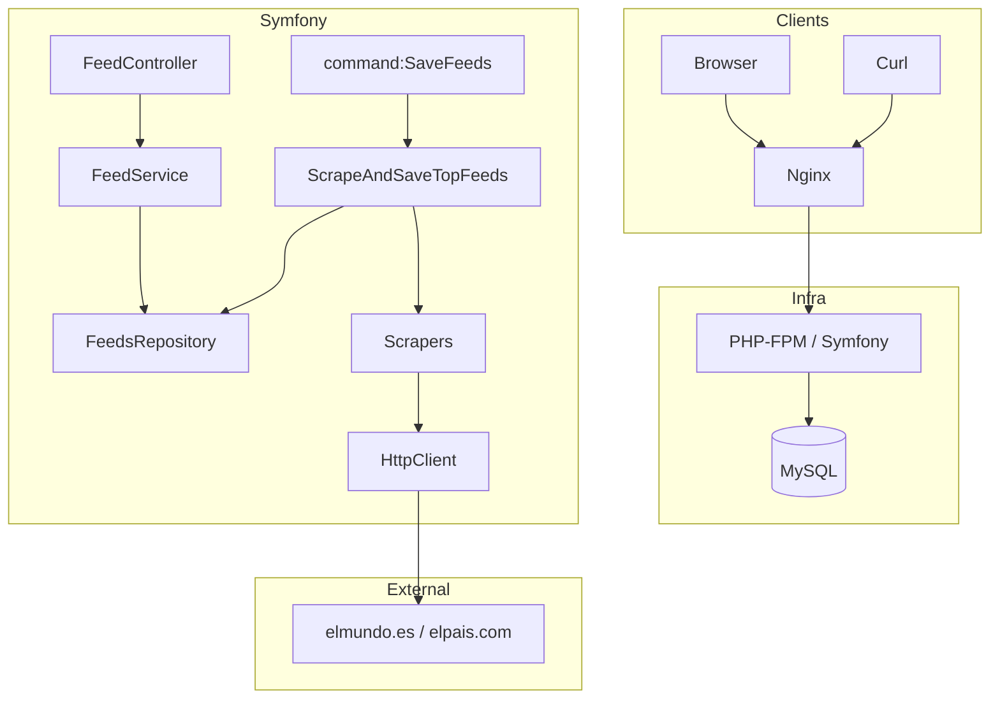
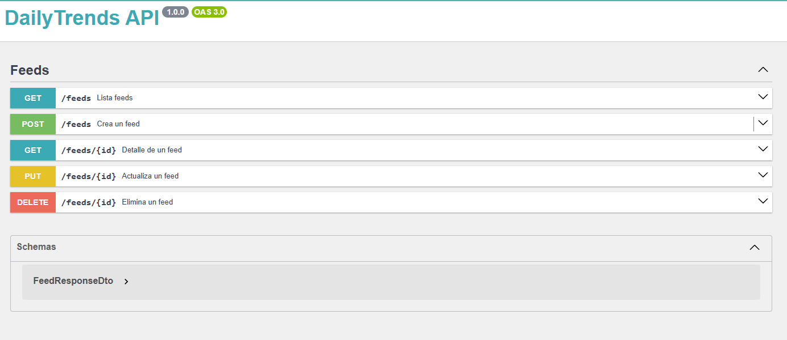

* [Arquitectura](#arquitectura)
* [Diagrama ](#diagrama)
* [Requisitos](#requisitos)
* [Puesta en marcha con Docker](#puesta-en-marcha-con-docker)
* [Comandos útiles](#comandos-útiles)
* [Ejecutar tests](#ejecutar-tests)
* [Endpoints API](#endpoints-api)
* [Modelo de datos](#modelo-de-datos)
* [Scrapers](#scrapers)
* [Documentación adicional](#documentación-adicional)

## Arquitectura

**Capa Web / API** (Symfony) → **Caso de uso** `ScrapeAndSaveTopFeeds` → **Repositorio** `FeedsRepository` (Doctrine) → **BD** (MySQL en prod, SQLite en test). Los scrapers (`ElPaisScraper`, `ElMundoScraper`) usan `HttpClientInterface` + `DomCrawler` y se inyectan por tag `app.scraper`.

## Diagrama 



> Fallback ASCII

```
[Client] -> [Nginx] -> [Symfony API] -> [FeedService] -> [FeedsRepository] -> [MySQL]
                                 ^
         [command:SaveFeeds] -> [ScrapeAndSaveTopFeeds] -> [Scrapers] -> (HTTP) -> El País/El Mundo
```

---

## Requisitos

* **Docker / Docker Compose**
* PHP, Composer y extensiones ya vienen dentro del contenedor `php`.
* Para tests se usa **SQLite** (extensión `pdo_sqlite` instalada en la imagen PHP).
* **PHPUnit 12** como dependencia de desarrollo (dentro del contenedor):

  ```bash
  docker compose exec php composer require --dev phpunit/phpunit:^12
  ```
* Define `DEFAULT_URI` para los tests funcionales (se fija en `phpunit.xml.dist`).

---

## Puesta en marcha con Docker

1. **Instalar dependencias** dentro del contenedor:

   ```bash
   docker compose exec php composer install --no-interaction
   ```
2. **Levantar stack** (si no lo está):

   ```bash
   docker compose up -d
   ```
3. **Variables de entorno** (ejemplo):

   * `.env`/`.env.local`: `DATABASE_URL="mysql://user:pass@db:3306/app?serverVersion=8.0&charset=utf8mb4"`

> Si usas migraciones, ejecútalas. En este proyecto el esquema se crea vía Doctrine a través de entidades; en test se recrea en SQLite automáticamente por los tests.

---

## Comandos útiles

* **Scrapear y guardar** (top 5 por medio):

  ```bash
  docker compose exec php php bin/console command:SaveFeeds
  ```
* **Abrir Tinker** (si lo usas):

  ```bash
  docker compose exec php php bin/console about
  ```

---


## Ejecutar tests

### Config necesaria

En `composer.json` añade:

```json
{
  "scripts": {
    "test": "APP_ENV=test ./vendor/bin/phpunit",
    "test:clean": "rm -rf var/cache/test .phpunit.cache && APP_ENV=test ./vendor/bin/phpunit"
  }
}
```

En `phpunit.xml.dist` (o `tests/bootstrap.php`), asegúrate de tener:

```xml
<php>
  <server name="APP_ENV" value="test" force="true"/>
  <server name="KERNEL_CLASS" value="App\\Kernel"/>
  <server name="DATABASE_URL" value="sqlite:///%kernel.cache_dir%/test.db"/>
  <server name="DEFAULT_URI" value="http://localhost"/>
</php>
```

> Si ves comportamientos extraños, usa siempre `composer run test:clean` para limpiar `var/cache/test` y `.phpunit.cache` antes de correr.

---

Usamos **PHPUnit 12 + SQLite**. Recomendado usar los **scripts de Composer** (incluyen limpieza de caché):

* **Todos los tests (limpiando caché)**

  ```bash
  docker compose exec php composer run test:clean
  ```

* **Todos los tests (rápido, sin limpiar)**

  ```bash
  docker compose exec php composer test
  ```

* **Alternativa directa (sin scripts)**

  ```bash
  docker compose exec php sh -lc 'rm -rf var/cache/test .phpunit.cache && APP_ENV=test ./vendor/bin/phpunit'
  ```

* **Filtrar por nombre de test/clase**

  ```bash
  docker compose exec php ./vendor/bin/phpunit --filter FeedControllerTest
  ```

* **Cobertura (opcional, con Xdebug)**

  ```bash
  docker compose exec php sh -lc 'XDEBUG_MODE=coverage APP_ENV=test ./vendor/bin/phpunit --coverage-html var/coverage'
  ```

---


## Endpoints API

Base: `GET /feeds`

| Método | Ruta          | Descripción     | OK  | Errores        |
| -----: | ------------- | --------------- | --- | -------------- |
|    GET | `/feeds`      | Lista de feeds  | 200 | —              |
|    GET | `/feeds/{id}` | Ver detalle     | 200 | 404            |
|   POST | `/feeds`      | Crear feed      | 201 | 400, 409*, 422 |
|    PUT | `/feeds/{id}` | Actualizar feed | 200 | 404, 409, 422  |
| DELETE | `/feeds/{id}` | Eliminar feed   | 204 | 404            |

**Notas**:

* Valida `title`, `url`, `source`; `image` y `publishedAt` son opcionales (`YYYY-MM-DD`).
* Duplicados se detectan por `source + url_hash(sha256(url))`.
* En `create()` ahora mismo la capa de servicio devuelve un mensaje de duplicado en el cuerpo; `update()` lanza `409`.

**Ejemplos**

```bash
# Crear
curl -X POST http://localhost/feeds \
  -H 'Content-Type: application/json' \
  -d '{
    "title":"Titular",
    "url":"https://ejemplo.com/x",
    "image":null,
    "publishedAt":"2025-10-10",
    "source":"elmundo"
  }'

# Listar
curl http://localhost/feeds
```

---

## Modelo de datos

Tabla `feeds`

* `id` INT PK autoincrement
* `title` VARCHAR(255)
* `url` VARCHAR(1024)
* `url_hash` VARCHAR(64) (sha256 de `url`)
* `image` VARCHAR(1024) NULL
* `published_at` DATETIME NULL (UTC+1 Europe/Madrid en creación)
* `source` VARCHAR(50)
* `created_at` DATETIME
* `updated_at` DATETIME

**Índices/únicos**

* `UNIQUE (source, url_hash)`

---

## Scrapers

* **ElPaisScraper**: filtra URLs tipo `/20YY/MM/DD/` o `.html`, evita placeholders de imagen, arma `publishedAt` con `now()`.
* **ElMundoScraper**: recoge enlaces de `article/h1/h2/h3`, deduplica por `url`, intenta extraer imagen cercana.
* Ambos usan headers (`user-agent`, `accept-language`) y `timeout` de 12s.
* Limpieza/normalización con `HtmlUtils` (tidy, absolutize, sanitizeUrl, parseSrcset, isArticleUrl).

---

# ETL

## Resumen

Este documento detalla la **Extracción, Transformación y Carga** del pipeline de titulares.

---

## Extract (E)

* Componentes: `ElPaisScraper`, `ElMundoScraper` (ambos etiquetados `app.scraper`).
* Transporte: `Symfony HttpClient` con `timeout: 12s`, UA `NewsTop5Bot/1.0`, `accept-language: es-ES`.
* Selectores: `DomCrawler` en `article a[href], h1 a[href], h2 a[href], h3 a[href]`.
* Filtros:

  * El País: URL debe contener `/20\d{2}/\d{2}/\d{2}/` **o** terminar en `.html`. Evita `/ultimas-noticias`.
  * El Mundo: descarta títulos vacíos o que contengan `comentarios`.
* Imagen: `imageFromCard()` busca `picture source[srcset]`/`img[srcset]`/`img[src|data-src]`, resuelve relativas con `absolutize()` y limpia con `sanitizeUrl()`.
* Límite: **5** ítems por scraper (`LIMIT = 5`).

---

## Transform (T)

* **Normalización de texto**: `HtmlUtils::tidy()` colapsa espacios, decodifica entidades HTML y recorta.
* **URLs**:

  * `absolutize(base, href)` para relativas.
  * `sanitizeUrl()` elimina query noise (`utm_*`, `gclid`, `fbclid`, `intcmp`, etc.).
  * `parseSrcset()` toma el primer recurso del `srcset`.
* **Evitar duplicados**: se construye `key = sha256(mb_substr(url, 0, 1024))` durante el scrape para evitar repetir en memoria; en persistencia se usa `url_hash`.
* **Fechas**: `publishedAt = now(Europe/Madrid)` si no se extrae explícitamente.
* **Estructura final de item**:

  ```php
  [
    'title' => string,
    'url' => string,        
    'image' => ?string,
    'publishedAt' => ?\DateTimeImmutable,
    'source' => 'elpais'|'elmundo'
  ]
  ```

---

## Load (L)

* **Caso de uso**: `ScrapeAndSaveTopFeeds::run()` itera scrapers y para cada lote invoca `FeedsRepository::upsertMany()`.
* **Upsert**:

  * Crea `url_hash = sha256(url_normalizada)`.
  * Busca por `source + url_hash`.
  * Si existe: `updateFrom(title, image, publishedAt)` → `updatedAt=now()`.
  * Si no existe: `new Feeds(...)` y `persist()`.
  * Transacción por lote; si falla algo, rollback y cuenta como `errors`.
* **Resumen**: `{ inserted, updated, errors }` por **source**.

---

## Orquestación

* **Manual**: `php bin/console command:SaveFeeds`.
* **Programada** (ejemplos):

  * Cron en el contenedor `php`: `*/15 * * * * php /var/www/html/bin/console command:SaveFeeds -q`
  * Supervisor/systemd según despliegue.

---

# OPERATIONS

## Objetivo

Este archivo complementa el README con **operativa** práctica y resolución de problemas recurrentes.

---

## Variables de entorno (ejemplos)

* `APP_ENV=prod|dev|test`
* `DATABASE_URL=mysql://user:pass@db:3306/app?serverVersion=8.0&charset=utf8mb4`
* `TZ=Europe/Madrid`

Para **test** (definido en `phpunit.xml.dist`):

* `APP_ENV=test`
* `KERNEL_CLASS=App\Kernel`
* `DATABASE_URL=sqlite:///%kernel.cache_dir%/test.db`

---

## Docker

* **Ejecutar comandos PHP** dentro del contenedor `php`:

  ```bash
  docker compose exec php php -v
  docker compose exec php composer install
  docker compose exec php php bin/console about
  ```

* **Errores típicos**

  * `/usr/bin/env: 'php': No such file or directory` → Estabas en el host, ejecuta **dentro** del contenedor (`docker compose exec php ...`).
  * `KERNEL_CLASS` ausente → añade en `phpunit.xml.dist` como en el README.
  * CRLF en scripts (`bin/phpunit`) → convertir finales de línea dentro del contenedor:

    ```bash
    apk add --no-cache dos2unix || (apt-get update && apt-get install -y dos2unix)
    dos2unix bin/phpunit vendor/bin/simple-phpunit
    ```
  * Falta SQLite en la imagen → instalar `pdo_sqlite` en Dockerfile y reconstruir.

---

## API Docs (Nelmio)


El proyecto usa anotaciones de **NelmioApiDoc/OpenAPI** en el `FeedController`. Si el bundle está habilitado y ruteado, podrás acceder a la UI típica (p. ej. `/api/doc` o `/api/docs`). Ajusta rutas según tu configuración.

---

## Estándares

* PHP 8.x, tipado estricto en la mayoría de clases.
* Estilo: PSR-12 (recomendado añadir PHP-CS-Fixer/PHPCS).
* Commits: convencional.

---